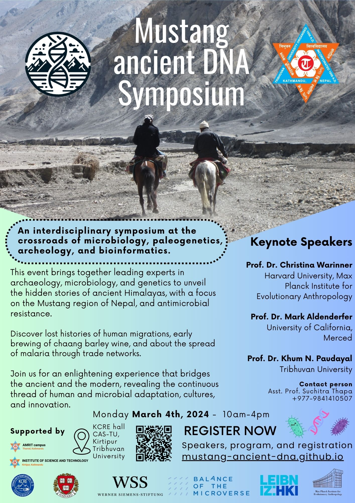

# Mustang Ancient DNA Symposium 

**An interdisciplinary symposium for life scientists and researchers, at the crossroads of microbiology, paleogenetics, archeology, and bioinformatics.**

Welcome to a journey through time and genetics at the 2024 Mustang Ancient DNA Symposium hosted by Tribhuvan University in Kathmandu, and Pokhara University, in Pokhara, Nepal. This event brings together leading experts in archaeology and genetics to unveil the hidden stories of ancient Himalayas, with a focus on the Mustang region of Nepal. Attesting to the power of interdisciplinary collaboration, this symposium explores the fascinating intersections of archaeology, microbiology, genetics, and bioinformatics to reveal lost histories of human migrations, the early brewing of chaang barley wine, antimicrobial resistance, and the spread of malaria through trade networks. Join us for an enlightening experience that bridges the ancient and the modern, revealing the continuous thread of human and microbial adaptations, cultures, and innovation.

## Date

- **March 4th, 2024**, in Tribuvan University, **Kathmandu**, Nepal

- **March 7th, 2024**, in Pokhara University, **Pokhara**, Nepal

## Schedule

<iframe src="https://calendar.google.com/calendar/embed?height=600&wkst=2&bgcolor=%23ffffff&ctz=Asia%2FKathmandu&showNav=0&mode=AGENDA&dates=20240304/20240304&showTitle=0&showCalendars=0&showPrint=0&src=ODlmZTgzM2FjNmU4YzE2MTZkNjI1YWRiNTUxOTdkOWJkMTAyNWZlNzQzNjc4NDdiOGIwMmFhNjYyNTA4ZjI2YkBncm91cC5jYWxlbmRhci5nb29nbGUuY29t&color=%23EF6C00" style="border-width:0" width="800" height="600" frameborder="0" scrolling="no"></iframe>

## Location

### Kathmandu

Hosted by IOST, Kirtipur, [Tribhuvan University, Kathmandu, Nepal](https://tu.edu.np/)  

**Event location**:  [KCRE hall, CAS-TU, Kirtipur](https://maps.app.goo.gl/usaxJZnKkvpEn2qT8)

<!-- <iframe width="425" height="350" src="https://www.openstreetmap.org/export/embed.html?bbox=85.27793884277345%2C27.674502068234272%2C85.29596328735353%2C27.68793630867814&amp;layer=mapnik" style="border: 1px solid black"></iframe> -->

<iframe width="425" height="350" src="https://www.openstreetmap.org/export/embed.html?bbox=85.28175294399261%2C27.68393423695017%2C85.28529345989229%2C27.68604098379294&amp;layer=mapnik&amp;marker=27.68498880302071%2C85.28352320194244" style="border: 1px solid black"></iframe>

### Pokhara

Pokhara University Research Center. More details to come.

## Registration

- [Register for the Kathmandu symposium](kathmandu "Kathmandu")
- [Register for the Pokhara meeting](pokhara "Pokhara")

### Registration Fee

The attendance is free of charge.

---

